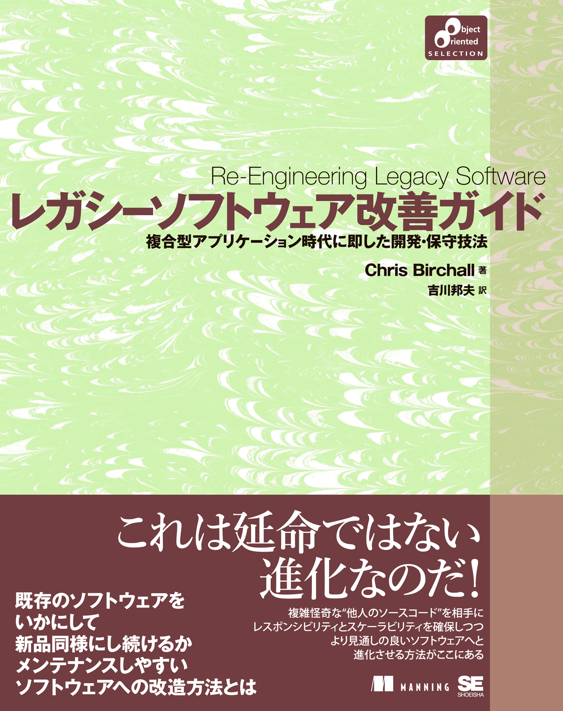
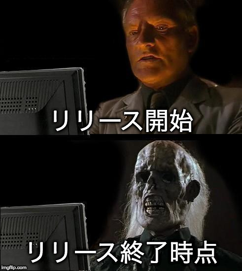
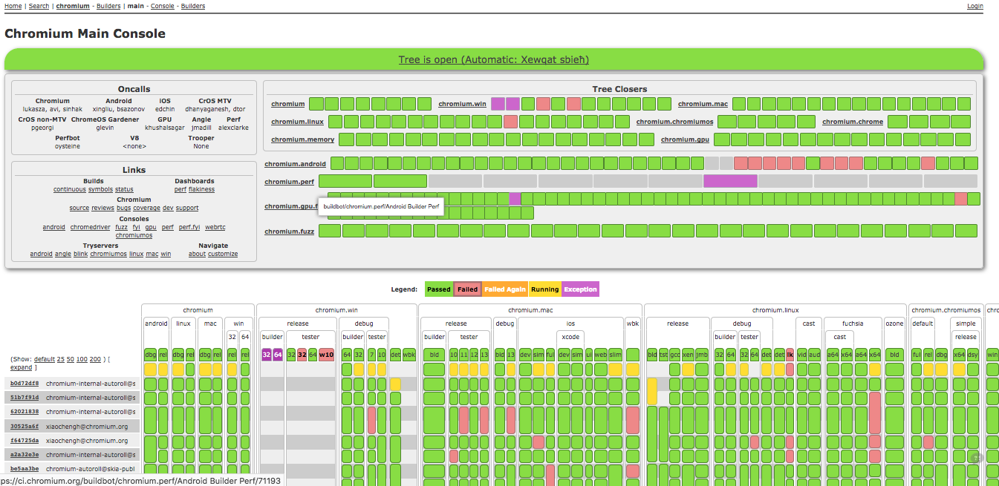
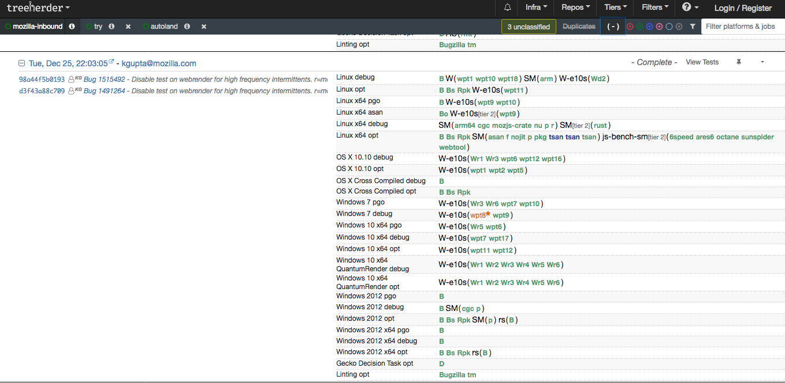
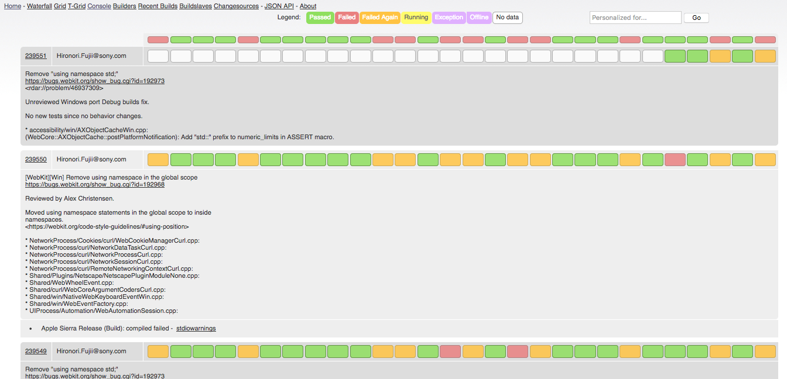
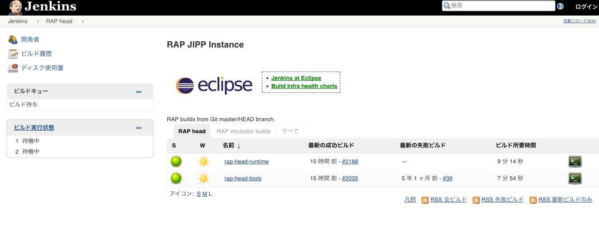
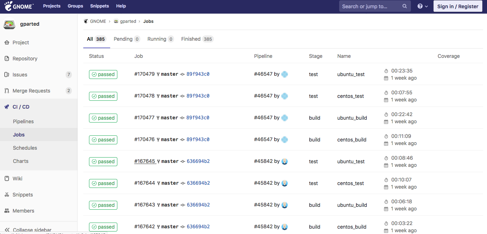

### q-tech Meeting #2

 ## レガシーソフトウェア(序章)

 [mantaroh(@\_mantaroh\_)](https://twitter.com/_mantaroh_)

>>>

 ## about:me

>>>

### 仕事

 吉永 満太朗

 所属: Systec Co.,Ltd

 肩書：Software engineer

>>>

### 家庭

 肩書：共同CEO 兼 CFO

>>>

 肩書：共同CEO 兼 CFO
 
 CEO(Chief Entertainment Officer)
 
 CFO(Chief Funny Officer)

---

 # 発表の前に

>>>

 # Firefox 使って！
 

---

 # 今日伝えたいこと①

>>>

 ## 「かごもく」にて、
 ## 「レガシーソフトウェア」を
 ## 扱った勉強会を開催します。
 ## 詳細は「かごもく」！

---

 # 今日伝えたいこと②

>>>

 # レガシーソフト
 # ウェアとは？

>>>

 # これを見てね



>>>

 # 〜完〜

---

  # レガシーあるある

  ### 注:ディスりではなく経験したOSS

>>>

 ### 1.古いツールチェイン

>>>

```
 とあるプロジェクトの開発環境リスト

 Windows アプリ：
  - Visual Studio 2003
  - .Net Framework 1.1

 Web アプリ：
  - Java SDK 1.5
  - Apache Struts
  - Oracle Database 9g

 Mobile アプリ
  - Android API Level 14 (ICS)
  - Eclipse

```

>>>


>>>

 ### 2.影響範囲が予測不能

>>>

```
例：
// 外部モジュールから参照されてる
var USER_KUBUN = 0;    // この区分に [3 : Student] 追加したい
…
function updateUser(KBN) {
   this.USER_KUBUN=KBN;
}
…
function getKUBUNString() {
  if (USER_KUBUN == 0) 
    return “Administrator”;
  else if (USER_KUBUN == 1) 
    return “Premium”;
  else if (USER_KUBUN ==2)
    return “Free”;
  else
    return “Unknown”;
}
```

>>>

 `USER_KUBUN` が色んなところから参照されており、変更による影響が予測不能。。

>>>

  ### 3. ソフトウェア手工業

>>>

```
例： とあるプロジェクトのリリース手順

１）リリース担当者は最新ソースコードをリリース専用マシンにコピー
２）リリース専用マシンでコードをビルドし、成果物を仮リリース
　　フォルダにコピーして、メールを送信
３）テスターはメールに記載されているオブジェクトをテスト
４）テスト不合格したら修正＆リリースを繰り返す
```

>>>



---

こうならないための、  
ここからは個人的な経験

---

# 複合機システム

>>>

## 20年選手のシステム

### ハード制約が大きい
### リリースに多大な工数を要する

>>>

## やったこと

* Jenkins によるビルド自動化
* 新規コードにはユニットテスト追加
* 静的解析によるコードメトリクス
* リリース時のテスト自動化

>>>

## 結果

* 開発スピード↑のために CI は必須
* プロダクトの性質に合わせた運用必要

>>>

# Mozilla Firefox

>>>

## 20年選手のプロダクト

### 数千人が関わってきた
### 古いコードが生きている

>>>

## やったこと

* 1人のソフトウェアエンジニアとして参戦
* たくさんのバグを生成

>>>

## 結果

* CI / Testing / Bug tracking は必須
* Bugzilla まじ神
* テストが多く影響範囲がわかりやすい

>>>

 # レガシーソフトウェアに CI は有効!

---

 ### 具体例
 ### Google / Mozilla /Apple etc..

---

# Google Chromium

>>>

* LUCI という CI ツールを利用
* 裏ではビルド・テストするクラウドサーバー(GOMAサーバー)

[Chromium Main Console](https://ci.chromium.org/p/chromium/g/main/console)

>>>



---

# Mozilla Firefox

>>>

* 独自の CI ツールを利用
* Treeherder で閲覧
* 全てのツリーのコミットを検知してビルド・テスト
* Try ツリーという試験的なツリーではビルド・テストを選択できる

[Mozilla Treeherder](https://treeherder.mozilla.org/)

>>>



---

# Apple Webkit

>>>

* buildbot が存在
* コミットごとにビルド・テスト

[Main Console](https://build.webkit.org/console)

>>>



---

# Eclipse RAP

>>>

* Gerrit (レビューツール)から検知して CI bot が動く
* Jenkins を用いてビルドを管理
* Jasmine にて手動テストも実施

[Eclipse RAP Jenkins](https://hudson.eclipse.org/rap/job/rap-3.1-runtime/)

>>>



---

# GNOME GPARTED

>>>

* GNOME は最近 GitLab へ移行
* GitLab CI を用いてビルド/テストを管理

[GParted GitLab CI](https://gitlab.gnome.org/GNOME/gparted/-/jobs)

>>>



---

レガシーソフトウェアと戦う武器

>>>

* Jenkins や Travis などの CI ツール
* 自動単体テスト
* トラッキングシステム(全文検索)
* 静的解析

>>>

 ## 「かごもく」にて、
 ## 「レガシーソフトウェア」を
 ## 扱った勉強会を開催します。
 ## 詳細は「かごもく」！

---

 ## ご静聴
 ## ありがとうございました。

 ### @\_mantaroh\_